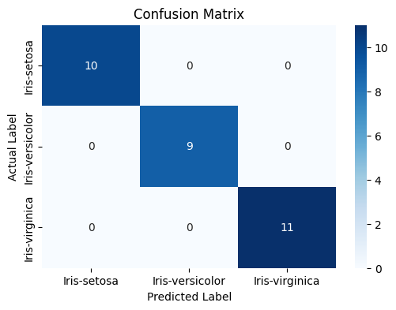

# Iris Flower Classification 🌸

This project is part of my **Data Science Internship** at **CodeAlpha**. The goal was to build a machine learning model that can classify iris flowers into three species (setosa, versicolor, virginica) based on their sepal and petal measurements.

## 📌 Project Overview
* **Student ID:** CA/DF1/22584
* **Internship Domain:** Data Science
* **Project Name:** Iris Flower Classification
* **Organization:** CodeAlpha

## 📂 Dataset
[cite_start]The dataset used is the classic **Iris Dataset**[cite: 79], which contains 150 samples of iris flowers. [cite_start]It includes the following features[cite: 81]:
* Sepal Length
* Sepal Width
* Petal Length
* Petal Width
* Target Class: Species (Iris-setosa, Iris-versicolor, Iris-virginica)

## 🛠️ Technologies Used
* [cite_start]**Python** (Programming Language) [cite: 61]
* [cite_start]**Pandas** (Data Manipulation) [cite: 61]
* **Matplotlib & Seaborn** (Data Visualization)
* [cite_start]**Scikit-Learn** (Machine Learning Library) [cite: 61, 83]
* **Google Colab / Jupyter Notebook** (IDE)

## 🚀 Key Features
1.  [cite_start]**Data Preprocessing:** Loaded the dataset and processed features[cite: 62].
2.  **Exploratory Data Analysis (EDA):** Created pairplots to visualize relationships between features.
3.  [cite_start]**Model Training:** Trained a **K-Nearest Neighbors (KNN)** classifier to predict species[cite: 82].
4.  [cite_start]**Model Evaluation:** Achieved **100% Accuracy** on the test set[cite: 84].
5.  **Visualization:** Plotted a Confusion Matrix to visualize true vs. predicted labels.

## 📊 Results
* **Accuracy:** 1.0 (100%)
* **Confusion Matrix:** Perfectly classified all test samples.

## 📷 Output
*()*

## 🤝 Acknowledgement
[cite_start]Thanks to **@CodeAlpha** for providing this opportunity to learn and apply Data Science concepts[cite: 71].

---
**Author:** Sunit Modak
**LinkedIn:** [https://www.linkedin.com/in/sunit-modak-6064403a5/]
